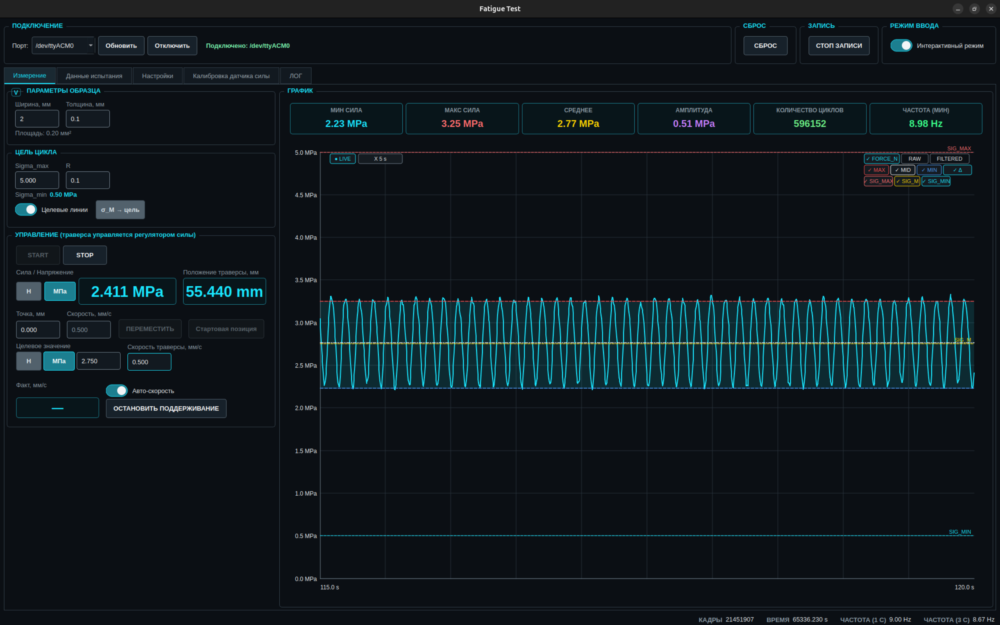

# Fatigue Test App

Настольное приложение (PyQt5) для управления установкой усталостных испытаний
материалов: опрос тензодатчика через STM32 по последовательному порту,
график силы в реальном времени, калибровка датчика и управление траверсой.

## Возможности

- Подключение к STM32 через serial (115200 бод, автоопределение портов).
- Непрерывный приём измерительных кадров (~330 Гц): RAW, FILTERED, FORCE_N (Н), CURRENT_MM (мм).
- Живой график силы (кастомный QPainter-виджет, история — окно 120 с при 330 SPS):
  три кривые (FORCE_N / RAW / FILTERED), настройка цветов, стилей и толщины линий, live-режим,
  выбор ширины окна X (2–120 с).
- Автоматический анализ циклов нагружения (поиск максимумов/минимумов с гистерезисом),
  счётчик циклов, амплитуда, средние/пиковые значения.
- Калибровка датчика силы: ноль (CALZERO), тарировка по образцовой массе (CALLOAD),
  чтение/применение калибровки на устройстве, хранение в `calibration.ini` по DEVICE_ID.
- Управление траверсой: перемещение к цели по оси 0 (позиция в мм, скорость), текущее положение и
  фактическая скорость (со стрелкой направления) из кадров.
- Автоматическое поддержание целевой силы: непрерывные MOVE-подстройки; решение — по среднему
  скользящего буфера значений (окно 5 при подходе к цели, 40 после выхода на цель), экспоненциальная
  авто-скорость (или ручная) с рампой медленного старта (0.25→1.0 за 3 с, без рывков), гистерезис
  допуска; управляемая величина — MID свежих циклов, при несвежих — аппроксимация (max+min)/2 окна
  5 с кадров; анти-фриз по смене пары MIN/MAX. Порог начала оценки циклов — управляемая величина
  в допуске ±0.1 Н / ±0.1 МПа от цели.
- Калибровка траверсы по усилию: кнопка «Калибровка» открывает диалог (скорость, порог изменения
  силы, отвод после триггера — сохраняются между сессиями; живой вывод силы и позиции) и отправляет
  `HOMEFORCE_<скорость>_<Δсилы>_<отвод>_YYY`.
- Целевые линии цикла (SIG_MAX/SIG_M/SIG_MIN) на графике и кнопка «σ_M → цель» — вносит середину
  целевого цикла в поле цели поддержания; кнопки SIG_MAX/SIG_M/SIG_MIN в третьем ряду управления
  графиком (ЛКМ — видимость линий, ПКМ — цвет), автоподстройка оси Y учитывает целевые линии.
- Запись сессии испытания: папка `Имя_дата_время` в настраиваемом пути, data.csv (поцикловая
  сводка по интервалу «30м/6ч/45с»), frames.csv (срезы кадров с позицией траверсы), ручная
  кнопка «ЗАПИСЬ» (работает и без измерения), экспорт PDF-отчёта (график, карточки статистики,
  таблица кадров за 30 с, параметры образца) и CSV.
- Детекция разрыва образца: пик силы за 5 с при около-нулевой силе 1 с → останов поддержания,
  финальное сохранение сессии `*_final`, STOP. Пороги — секция `[RUPTURE]` app_settings.ini.
- Лог обмена с устройством (hex-кадры и текстовые ответы) + файловый DEBUG-лог (`logs/app_debug.log`,
  ротация 5 МБ ×3; формат `SND`/`RCV`).

## Запуск

Зависимости: Python 3.8+, PyQt5, pyserial.

```bash
pip install PyQt5 pyserial
python main.py
```

Приложение ищет `configs/calibration.ini` (репо-корень).

## Структура проекта

```
main.py                 # точка входа: импорты окон, QApplication, запуск
src/                    # весь код приложения (пакет)
  __init__.py
  protocol.py           # константы протокола и обмена с STM32 (команды, формат кадра, пути)
  graph_widget.py       # ForceGraphWidget: живой график, отрисовка (анализ циклов — cycle_analyzer.py)
  main_window.py        # MainWindow: UI-сборка, стили, вкладки измерения/настроек/данных
  widgets.py            # ToggleSwitch, CollapsibleGroupBox
  traverse_safety.py    # границы хода, стопор по силе, аварийное окно, HOME
  traverse_regulator.py # регулятор поддержания силы (буфер решений, рампа старта, анти-фриз)
  home_dialog.py        # HomeCalibrationDialog: диалог калибровки траверсы по усилию (HOMEFORCE)
  serial_protocol.py    # подключение, TX/RX, парсинг кадров и ответов
  serial_worker.py      # SerialWorker (QThread): чтение порта в фоне, кадры/ответы
                        # в GUI через queued-сигналы, TX через очередь
  calibration.py        # вкладка калибровки, калибровочные команды и INI
  measurement_session.py # старт/стоп, таймер 100 мс, запись сессии, экспорт
  app_settings_io.py    # app_settings.ini (загрузка/сохранение), closeEvent
  cycle_analyzer.py     # CycleAnalyzerMixin: FSM детектора циклов (из graph_widget)
  session_recorder.py   # SessionRecorder: запись сессии (data.csv), экспорт PDF/CSV, parse_interval
  logging_setup.py      # логгер 'fatigue': консоль INFO + rotating logs/app_debug.log DEBUG
configs/                # ini-конфиги
  calibration.ini       # сохранённые калибровки (секции по DEVICE_ID)
  app_settings.ini      # настройки: образец/запись ([RECORDING]), размеры ([SPECIMEN]),
                        # траверса ([TRAVERSE]), цель цикла ([CYCLE_TARGET]), HOME ([HOME]),
                        # разрыв ([RUPTURE])
docs/                   # документация: беклог, решения, техдолг, баги, GUI.png, PIPELINE.md
backup/                 # старые версии main.py (исторический мусор, в git не нужен)
logs/                   # ротируемый DEBUG-лог (в git не нужен)
```

Разделение на модули сделано рефакторингом (см. `docs/DECISIONS.md`, ADR-001):
поведение не менялось, тела классов перенесены без изменений.
Пайплайн потоков данных (RX/TX/регулятор/таймеры) — `docs/PIPELINE.md`.

## Интерфейс



Вкладки: **Измерение**, **Данные испытания**, **Настройки**,
**Калибровка датчика силы**, **ЛОГ**.

Типовой сценарий: выбрать порт → Connect → появление `DEVICE_ID_...` →
вкладка «Калибровка»: CALZERO (без нагрузки) → CALLOAD (с образцовой массой) →
калибровка сохраняется в ini и применяется на устройстве (CALAPPLY) →
вкладка «Измерение»: Start/Stop, график и счётчик циклов.

## Протокол обмена с STM32

Скорость 115200, ASCII-команды, завершение суффиксом `_YYY`.

| Направление | Сообщение | Смысл |
|---|---|---|
| → MCU | `HELLO_YYY` | рукопожатие, ответ `DEVICE_ID_<id>_YYY` |
| → MCU | `CALZERO_YYY` | обнулить датчик, ответ `CAL_ZERO_OK_YYY` / `CAL_NOT_READY_YYY` |
| → MCU | `CALLOAD_YYY` | тарировка по массе, ответ `CAL_LOAD_OK_YYY` / `CAL_NOT_READY_YYY` |
| → MCU | `CALGET_YYY` | прочитать калибровку, ответ `CAL_DATA_..._YYY` |
| → MCU | `CALAPPLY_<zero>_<gain>_YYY` | применить калибровку, ответ `CAL_APPLY_OK_..._YYY` |
| → MCU | `START_YYY` / `STOP_YYY` | старт/стоп потока измерений, ответы `START_OK_YYY` / `STOP_OK_YYY` |
| → MCU | `TARGETN_<n>_YYY` | целевая сила (после старта шлётся 1.0 N) |
| → MCU | `MOVE_<axis>_<target_mm>_<speed>_YYY` | переместить траверсую |
| → MCU | `HOMEFORCE_<speed>_<Δсилы>_<отвод>_YYY` | калибровка траверсы по усилию (параметры — из диалога «Калибровка») |

**Измерительный кадр** (binary, little-endian, `struct` формат `<BiiffB`, 18 байт):

| Поле | Тип | Описание |
|---|---|---|
| start | B (uint8) | 0xAA |
| raw | i (int32) | сырой счёт АЦП |
| filtered | i (int32) | отфильтрованный счёт АЦП |
| force_n | f (float32) | сила, Н — **считается на STM32** |
| current_mm | f (float32) | положение траверсы, мм |
| end | B (uint8) | 0xBB |

CRC нет — валидность кадра определяется только маркерами 0xAA/0xBB.

## Калибровка

`gain_g_per_count` = масса_г / (load_raw − zero_raw) — чувствительность в граммах на счёт АЦП.
Пересчёт силы в Ньютоны выполняется на устройстве; ПК только сохраняет/применяет
`zero_value` и `gain_g_per_count`. `GRAVITY = 0.00980665` — перевод гс→Н.

Формат `calibration.ini`:

```ini
[CALIBRATION]
device_id = 004C...
zero_value = 517513
gain_g_per_count = 0.00514103098513
```

## Известные ограничения

Приоритетные проблемы и планы по ним ведутся в `docs/`: техдолг — `TECH_DEBT.md`,
известные баги — `BUGS.md`, беклог — `BACKLOG.md`, принятые решения — `DECISIONS.md`.

Приоритетные проблемы (исторический список):

1. ~~**Serial I/O в GUI-потоке**~~ — **решено 2026-10-09**: чтение порта и парсинг кадров
   вынесены в `SerialWorker` (QThread, `src/serial_worker.py`), кадры и ответы доставляются
   в GUI через queued-сигналы, TX через очередь воркера. Стресс-тест 330 Гц: CPU GUI-потока
   100% → 23%, принятых кадров 231 → 321 fps. На стенде проверить connect/disconnect и тайминги
   TX-команд (отправка теперь асинхронна).
2. ~~**Отрисовка окна Python-циклом**~~ — **решено 2026-10-09**: децимация min/max по пиксельным
   столбцам (~2k точек) + один QPainterPath в `draw_signal`; render 40k точек: 48 мс → 4.3 мс.
   Пики сохраняются по построению (огибающая min/max).
3. ~~**Буферы на списках**~~ — **частично**: `rx_buffer` ограничен (65536), `check_rupture`
   сканирует окно с конца (было O(n²) за сессию). Списки `values/frame_times` оставлены —
   deque/RingBuffer на горячем пути проверены замером и дали регресс 10×; O(n)-сдвиг
   `del list[:n]` стоит <1% ядра.
4. **Нет CRC и ACK-таймаутов** — битый кадр принимается как валидный; очистка графика в
   `send_start` происходит до подтверждения `START_OK_YYY`. План: CRC в протоколе,
   проверка диапазонов полей, подтверждения с таймаутами.
5. **Монолит ~5k строк в 2 классах** — god-objects, нет тестов. План: выделить
   `protocol.py`, `SerialManager`, `DataBuffer`, `CycleAnalyzer`, `GraphRenderer`.

Мелочи: мёртвый код (`add_value`, `create_line_style_combo`), дубли логгеров,
кнопки, нарисованные вручную QPainter'ом, магические числа анализа циклов
(`cycle_tolerance`, `cycle_turn_confirm`), пустые вкладки-заглушки, неатомарная запись ini,
каталог `backup/` следует удалить.

## Репозиторий

https://github.com/arduineks/fatigue_test_app