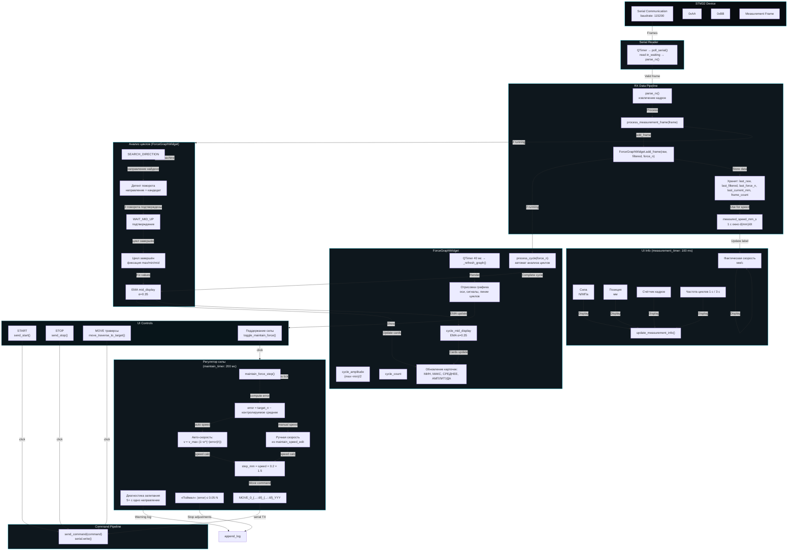

# Пайплайн потоков данных

## Общее описание

Пайплайн fatigue test app состоит из двух основных потоков и системы анализа циклов:

### 1. Поток данных RX (STM32 → UI)

**Serial-кадры от STM32:**
- STM32 посылает кадра через Serial (baudrate 115200)
- Формат кадра: `<BiiffB` — start byte 0xAA, raw ADC, отфильтрованная сила, force_n (Н), current_mm (позиция траверсы), end byte 0xBB
- `serial_timer` (период 5 ms) вызывает `poll_serial()` → читает входящие данные → `parse_rx()` → извлекает валидные кадры → `process_measurement_frame(frame)`

**Что делает `process_measurement_frame`:**
- Распаковывает структуру, сохраняет `last_raw`, `last_filtered`, `last_force_n`, `last_current_mm`
- Увеличивает `frame_count`
- Вычисляет `measured_speed_mm_s`: скорость траверсы по скользящему 1-секундному окну изменений позиции (скользящее 1-секундное окно, сглаживает квантование CURRENT_MM на устройстве)
- Передаёт данные в график: `force_graph.add_frame(raw, filtered, force_n)`
- Обновляет UI метки: force label, position label, frame count

**ForceGraphWidget — прием данных:**
- `add_frame(raw, filtered, force_n)`: добавляет в `self.values`, `self.raw_values`, `self.filtered_values`
- Если `running`: вызывает `process_cycle(force_n)` для анализа циклов
- `update_timer` (период 40 ms): `_refresh_graph()` — перерисовывает график
- `measurement_timer` (период 100 ms): `update_measurement_info()` — обновляет метки интерфейса:
  - Текущая сила (с конвертацией Н/МПа)
  - Позиция траверсы
  - Факт скорости траверсы (mm/s)
  - Количество кадров
  - Частота циклов (1 с и 3 с окна)

### 2. Поток команд UI → STM32 (TX)

**Команды из интерфейса:**

- **START** (`send_start`): отправляет `START_YYY` — начинает измерение на STM32
- **STOP** (`send_stop`): отправляет `STOP_YYY` — останавливает измерение на STM32
- **MOVE** (траверса): `move_traverse_to_target()` → `MOVE_0_{target_mm:.6f}_{speed:.6f}_YYY`
  - Точка и скорость форматируются с 6 знаками после запятой (последний коммит c52e11d)
- **Поддержание силы** (regulator, MAINTAIN_PERIOD_MS = 200 ms):
  - `toggle_maintain_force()`: старт/стоп регулятора
  - `maintain_force_step()` (вызывается каждые 200 ms timer'ом):
    - Читает `last_force_n` и `last_current_mm` из последнего RX-кадра
    - Вычисляет ошибку: `error = target_n_actual - current_force`
    - **Авто-скорость** (галочка `maintain_auto_speed_check`):
      - `speed_mm_s = MAINTAIN_AUTO_SPEED_MAX × (1 - exp(-|error| / MAINTAIN_SPEED_TAU_N))`
      - Кламп: [MAINTAIN_AUTO_SPEED_MIN, MAINTAIN_AUTO_SPEED_MAX] = [0.001, 5.0] mm/s
    - **Ручной режим**: использует значение из `maintain_speed_edit`
    - Диагностика залипания: если одно и то же направление держится в течение 5+ с без изменения управляемой величины → лог предупреждения
    - **Цель поймана**: если |error| ≤ MAINTAIN_FORCE_TOLERANCE (0.05 N) — останавливает MOVE, подстройки прекращаются до выхода ошибки за допуск
    - Шаг движения: `step_mm = speed_mm_s × period_s × MAINTAIN_STEP_FACTOR` (period_s = 0.2 s, factor = 1.5)
    - Отправляет: `MOVE_0_{target_mm:.6f}_{speed_mm_s:.6f}_YYY`

### 3. Анализ циклов (в ForceGraphWidget)

**Детектор циклов** (`process_cycle(force)`):
- Finite state machine: `SEARCH_DIRECTION` → детект поворота → `WAIT_MID_UP` → подтверждение MID → completion
- Удерживает pending extremes в течение цикла (строки MAX/MIN и СРЕДНЕЕ появляются только при завершении цикла)
- При завершении цикла фиксирует:
  - `cycle_max_value`, `cycle_min_value` — подтвержденные экстремумы
  - `cycle_mid_value` = (`cycle_pending_max` + `cycle_pending_min`) / 2 — средняя линия
  - `cycle_amplitude` = (`cycle_max` - `cycle_min`) / 2 — амплитуда
  - `cycle_count` — инкремент
  - `cycle_mid_display` — EMA (α=0.35) от mid завершённых циклов (сглаживание между циклами)

**Карточки UI (анализ циклов):**
- МИН СИЛА: `cycle_min_value` (цвет #19E6FF)
- МАКС СИЛА: `cycle_max_value` (цвет #FF6B6B)
- СРЕДНЕЕ: `cycle_mid_value` (цвет #FFD400, также белый график линии)
- АМПЛИТУДА: (`cycle_max` - `cycle_min`) / 2 (цвет #C77DFF)
- КОЛИЧЕСТВО ЦИКЛОВ: `cycle_count`

### 4. Таймеры и сигналы

| Таймер | Период | Функция |
|---|---|---|
| `serial_timer` | 5 ms | `poll_serial()` — чтение данных с STM32 |
| `update_timer` (в graph) | 40 ms | `_refresh_graph()` — перерисовка графика |
| `measurement_timer` | 100 ms | `update_measurement_info()` — обновление меток UI |
| `maintain_timer` | 200 ms | `maintain_force_step()` — регулятор поддержания силы |
| flush-таймер записи | интервал из «Настроек» (`parse_interval`, дефолт 30 мин) | `SessionRecorder.flush()` — дописывает буфер поцикловых строк в `data.csv` сессии |

### 5. Запись сессии испытания (SessionRecorder, этап 0)

- `update_measurement_info()` (таймер 100 мс) при росте счётчика циклов
  добавляет строку поцикловой статистики в `session_recorder.add_cycle_row()`
  (не из serial-пути).
- `send_start()`: если запись активна — `stop_session()`; затем
  `start_session(base_path, specimen_name)` — папка
  `<Имя образца>_<дд-мм-гггг>_<ЧЧ-ММ-СС>` внутри пути из «Настроек»
  (дефолт `<репо>/Saved data`), `data.csv` с заголовком; имя папки
  гарантированно уникально (суффикс _2/_3… при совпадении).
- Ручная запись: кнопка «СТАРТ ЗАПИСИ / СТОП ЗАПИСИ» (блок «ЗАПИСЬ» верхней
  строки) — запись работает и без START измерения (осцилляция через
  «Поддержание силы»); elapsed строк — от старта записи, когда измерение
  не запущено, иначе от START.
- `send_stop()`: `stop_session()`.
- Flush-таймер (интервал из «Настроек», универсальный формат «30м»/«6ч»/«45с»/
  голое число = минуты) дописывает буфер в `data.csv`.
- Кнопка «СБРОС» (верхняя строка, слева от «Режим ввода»): сброс сессии —
  `force_graph.reset_session()`, буфер записи, карточки.
- Вкладка «Данные испытания»: «Экспорт PDF» (grab() графика + карточки +
  таблица циклов за последние 30 с, QPdfWriter; страница 2 — данные графика
  за последние 60 с с равномерной прореженностью) и «Экспорт CSV» (те же
  секции + полные кадры за 60 с: время, RAW, фильтр, сила) в папку сессии.
  Кадры с метками времени — `frame_times` в ForceGraphWidget,
  `get_recent_frames(seconds)`.
- Настройки (имя образца, интервал, путь) — `app_settings.ini`, вкладка
  «Настройки» (бывшая заглушка «Управление траверсой»). Там же группа
  «ТРАВЕРСА»: верхняя граница хода (145 мм), стартовая позиция (10 мм) и
  скорость выхода на старт (0.5 мм/с); после подключения к устройству
  траверса выходит на стартовую позицию; цель MOVE (ручная и регулятора)
  ограничивается верхней границей. Секция [TRAVERSE] сохраняется между
  сессиями.
- Стопор по силе: каждый RX-кадр проверяется `check_force_stop()` — при
  силе ≤ порога («Стопор по силе, Н», дефолт −5) останавливаются
  поддержание, измерение и запись, траверса уходит в стартовую позицию
  (MOVE, скорость 5 мм/с). Защёлка снимается «СБРОС» или
  переподключением.
- Превышение верхней границы хода: каждый RX-кадр проверяется
  `check_traverse_limit()` — позиция из кадра > «Верхняя граница, мм»
  останавливает поддержание/измерение/запись (без авто-MOVE). Оба
  аварийных случая показывают красное модальное окно «АВАРИЙНАЯ
  ОСТАНОВКА» (причина + сила + положение траверсы).

## Пайплайн потоков данных (Mermaid)

## Ключевые функции с файл:строка

**calibration_window.py:**
- `poll_serial()` (line 2469): Serial timer callback — чтение данных с STM32, вызов parse_rx()
- `parse_rx()` (line 2493): RX parser — извлечение кадров, вызов process_measurement_frame()
- `process_measurement_frame(frame)` (line 2631): Обработка кадра STM32 — распаковка, обновление last_*, speed calculation, вызов force_graph.add_frame()
- `send_command(command)` (line 2348): Отправка команды по serial, лог TX
- `toggle_maintain_force()` (line 2378): Старт/стоп регулятора силы, управление maintain_timer (200 ms)
- `maintain_force_step()` (line 3804): Регулятор шаг — вычисление ошибки, скорости, MOVE команда, диагностика залипания и цели пойманной
- `start_measurement()` (graph_widget.py line 341): Запуск измерения — clear values, running=True, reset cycle analysis
- `stop_measurement()` (graph_widget.py line 361): Остановка измерения — running=False
- `process_cycle(force)` (graph_widget.py line 536): Анализатор циклов — state machine SEARCH_DIRECTION → turn detection → WAIT_MID_UP → подтверждение extremes → cycle completion, EMA mid_display
- `add_frame(raw, filtered, force_n)` (graph_widget.py line 417): Добавление кадра в график — store in values/raw_values/filtered_values, process_cycle если running
- `update_measurement_info()` (calibration_window.py line 3289): Обновление меток UI — force, position, speed, frame count, cycle freq 1s/3s
- `maintain_timer.timeout` connection (calibration_window.py line 240-243): QTimer 200 ms → maintain_force_step
- `serial_timer.timeout` connection (calibration_window.py line 213-217): QTimer 5 ms → poll_serial
- `measurement_timer.timeout` connection (calibration_window.py line 223-227): QTimer 100 ms → update_measurement_info
- `ForceGraphWidget.update_timer` (graph_widget.py line 150-160): QTimer 40 ms → _refresh_graph

**graph_widget.py:**
- `ForceGraphWidget.__init__` (line 189): Инициализация cycle state, extremes, mid tracking
- `ForceGraphWidget.start_measurement` (line 341): Сброс данных, запуск измерения
- `ForceGraphWidget.add_frame` (line 417): Прием данных от serial, добавление в график, процесс циклов
- `ForceGraphWidget.process_cycle` (line 536): Полный анализатор циклов с finite state machine
- `ForceGraphWidget._refresh_graph` (line 1165): Обновление графика (40 ms timer)
- `ForceGraphWidget.draw_cycle_analysis` (line 778): Отрисовка линий MAX/MID/MIN и коридора
